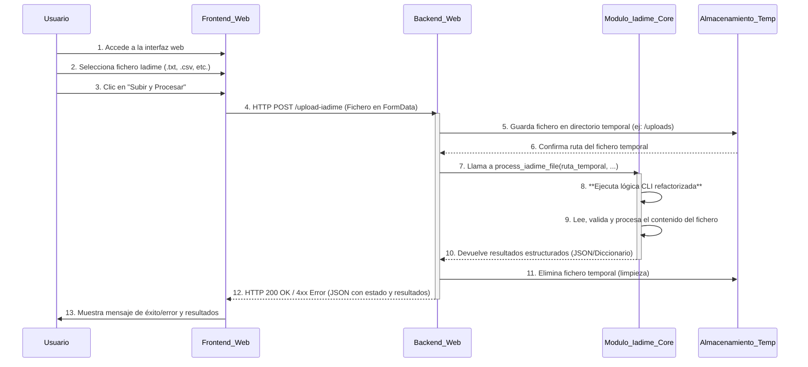

## Usuario
Puedes darme ayudarme a implementar el envio de ficheros en iadime-web? me gustaria aprovechar como esta funcionando ya en version de consola, si se puede

## IA
¡Claro que sí! Es una excelente idea reutilizar la lógica de tu versión de consola (CLI) para la versión web de Iadime. Esto te ahorrará mucho trabajo y asegurará la consistencia en el procesamiento de ficheros.

Para darte la ayuda más precisa y ejemplos de código, necesito saber **qué tecnologías estás usando en Iadime-Web**.

Por ejemplo:
*   **Lenguaje del backend:** Python, Node.js, PHP, Java, etc.
*   **Framework del backend:** Flask, FastAPI, Django (Python), Express, NestJS (Node.js), Laravel, Symfony (PHP), Spring Boot (Java), etc.
*   **Frontend:** ¿Estás usando un framework (React, Angular, Vue) o JavaScript vanilla, jQuery?

Mientras tanto, te voy a dar una **estrategia general** y un **ejemplo común** usando un backend Python (Flask/FastAPI) y un frontend con JavaScript vanilla, que es una configuración muy común y fácil de entender.

---

## Usuario
puedes ayudarme a implementar el envio de ficheros en iadime-web? me gustaria aprovechar como esta funcionando ya en version de consola, si se puede.

## IA
¡Excelente idea! Reutilizar la lógica de tu versión de consola (CLI) para la versión web de Iadime es una estrategia muy inteligente. Te ahorrará mucho tiempo de desarrollo y garantizará la consistencia en el procesamiento de los ficheros.

Para poder darte la ayuda más precisa y ejemplos de código, necesito saber **qué tecnologías estás usando en Iadime-Web**.

Por ejemplo:
*   **Lenguaje del backend:** Python, Node.js, PHP, Java, etc.
*   **Framework del backend:** Flask, FastAPI, Django (Python), Express, NestJS (Node.js), Laravel, Symfony (PHP), Spring Boot (Java), etc.
*   **Frontend:** ¿Estás usando un framework (React, Angular, Vue) o JavaScript vanilla, jQuery?

Mientras tanto, te voy a dar una **estrategia general** y un **ejemplo común** usando un backend Python (Flask) y un frontend con JavaScript vanilla, que es una configuración muy común y fácil de entender.

---

### Estrategia General para Reutilizar la Lógica de Consola

La clave para aprovechar tu lógica de consola es **refactorizarla** para que sea accesible como una **librería o módulo** que tu aplicación web pueda importar y llamar.

**1. Refactorizar la Lógica de Consola (¡Paso Crucial!)**

*   **Problema:** Tu script de consola probablemente lee argumentos de línea de comandos, rutas de ficheros, etc.
*   **Solución:** Extrae el "corazón" de tu lógica de procesamiento de ficheros en una o varias funciones. Estas funciones deben aceptar la ruta del fichero de entrada (y cualquier otro parámetro necesario) como argumentos, y devolver el resultado del procesamiento.
*   **Ejemplo:**
    *   **Antes (CLI):**
        ```python
        # iadime_cli.py
        import sys
        
        def main():
            filepath = sys.argv[1]
            # ... mucha lógica de procesamiento ...
            print("Procesamiento completado para", filepath)
            # ...
        
        if __name__ == "__main__":
            main()
        ```
    *   **Después (Módulo Reutilizable):**
        ```python
        # iadime_core.py
        import os
        
        def process_iadime_file(filepath: str, config_params: dict = None) -> dict:
            """
            Procesa un fichero de Iadime y devuelve un resumen o resultados.
            """
            if not os.path.exists(filepath):
                raise FileNotFoundError(f"El fichero no existe: {filepath}")
            
            print(f"Iniciando procesamiento de Iadime para: {filepath}")
            
            # --- Aquí va la lógica principal de tu versión de consola ---
            # Abre el fichero, lee su contenido, aplica las transformaciones,
            # validaciones, cálculos, etc.
            
            # Simulación de procesamiento
            with open(filepath, 'r', encoding='utf-8') as f:
                content = f.read()
            
            lines_count = len(content.splitlines())
            
            # Puedes usar config_params si tu CLI tiene opciones configurables
            # Por ejemplo: if config_params and config_params.get('verbose'): ...
            
            # --- Fin de la lógica principal ---
            
            print(f"Fichero {filepath} procesado. Líneas: {lines_count}")
            
            return {
                "status": "success",
                "message": "Fichero procesado correctamente",
                "filename": os.path.basename(filepath),
                "lines_processed": lines_count,
                # ... otros resultados relevantes de tu lógica ...
            }

        def validate_iadime_file(filepath: str) -> bool:
            """
            Valida si un fichero cumple los requisitos de Iadime.
            """
            # ... lógica de validación ...
            return True # o False si no es válido
        ```
        Tu script `iadime_cli.py` ahora simplemente importaría y llamaría a `process_iadime_file`.

**2. El Frontend (HTML y JavaScript)**

El frontend se encargará de mostrar un formulario para que el usuario seleccione el fichero y luego lo enviará al backend usando AJAX.

*   **HTML:**
    ```html
    <!DOCTYPE html>
    <html lang="es">
    <head>
        <meta charset="UTF-8">
        <meta name="viewport" content="width=device-width, initial-scale=1.0">
        <title>Subir Fichero Iadime</title>
        <style>
            body { font-family: sans-serif; margin: 20px; }
            #uploadForm { margin-top: 20px; padding: 20px; border: 1px solid #ccc; border-radius: 5px; }
            #fileInput { margin-bottom: 10px; }
            #uploadButton { padding: 10px 20px; background-color: #007bff; color: white; border: none; border-radius: 4px; cursor: pointer; }
            #uploadButton:hover { background-color: #0056b3; }
            #statusMessage { margin-top: 20px; padding: 10px; border-radius: 4px; display: none; }
            #statusMessage.success { background-color: #d4edda; color: #155724; border: 1px solid #c3e6cb; }
            #statusMessage.error { background-color: #f8d7da; color: #721c24; border: 1px solid #f5c6cb; }
            #loadingSpinner { display: none; border: 4px solid #f3f3f3; border-top: 4px solid #3498db; border-radius: 50%; width: 20px; height: 20px; animation: spin 2s linear infinite; margin-left: 10px; }
            @keyframes spin {
                0% { transform: rotate(0deg); }
                100% { transform: rotate(360deg); }
            }
        </style>
    </head>
    <body>
        <h1>Subir Fichero Iadime</h1>

        <form id="uploadForm" enctype="multipart/form-data">
            <label for="fileInput">Selecciona tu fichero Iadime:</label><br>
            <input type="file" id="fileInput" name="iadimeFile" accept=".txt,.csv,.xml"><br><br>
            <button type="submit" id="uploadButton">Subir y Procesar</button>
            <div id="loadingSpinner"></div>
        </form>

        <div id="statusMessage"></div>

        <script>
            document.getElementById('uploadForm').addEventListener('submit', async function(event) {
                event.preventDefault(); // Evita el envío tradicional del formulario

                const fileInput = document.getElementById('fileInput');
                const statusMessage = document.getElementById('statusMessage');
                const uploadButton = document.getElementById('uploadButton');
                const loadingSpinner = document.getElementById('loadingSpinner');

                statusMessage.style.display = 'none';
                statusMessage.className = '';
                uploadButton.disabled = true;
                loadingSpinner.style.display = 'inline-block';

                if (!fileInput.files.length) {
                    statusMessage.textContent = 'Por favor, selecciona un fichero para subir.';
                    statusMessage.className = 'error';
                    statusMessage.style.display = 'block';
                    uploadButton.disabled = false;
                    loadingSpinner.style.display = 'none';
                    return;
                }

                const formData = new FormData();
                formData.append('iadimeFile', fileInput.files[0]); // 'iadimeFile' debe coincidir con el nombre esperado en el backend

                try {
                    const response = await fetch('/upload-iadime', { // Esta es la URL de tu endpoint en el backend
                        method: 'POST',
                        body: formData
                    });

                    const result = await response.json();

                    if (response.ok) {
                        statusMessage.textContent = `Éxito: ${result.message || 'Fichero procesado correctamente.'} Líneas procesadas: ${result.lines_processed || 'N/A'}`;
                        statusMessage.className = 'success';
                    } else {
                        statusMessage.textContent = `Error: ${result.message || 'Hubo un problema al procesar el fichero.'}`;
                        statusMessage.className = 'error';
                    }
                } catch (error) {
                    console.error('Error al subir el fichero:', error);
                    statusMessage.textContent = `Error de red o servidor: ${error.message}`;
                    statusMessage.className = 'error';
                } finally {
                    statusMessage.style.display = 'block';
                    uploadButton.disabled = false;
                    loadingSpinner.style.display = 'none';
                }
            });
        </script>
    </body>
    </html>
    ```

**3. El Backend (Ejemplo con Python Flask)**

El backend recibirá el fichero, lo guardará temporalmente, llamará a tu lógica refactorizada de Iadime y devolverá una respuesta al frontend.

*   **Estructura de Carpetas:**
    ```
    iadime_web/
    ├── app.py                  # Tu aplicación Flask
    ├── iadime_core.py          # Tu lógica refactorizada de Iadime
    ├── templates/
    │   └── index.html          # El HTML del frontend
    └── uploads/                # Carpeta para guardar ficheros subidos temporalmente
    ```

*   **`app.py` (Aplicación Flask):**
    ```python
    from flask import Flask, request, jsonify, render_template
    import os
    import uuid # Para generar nombres de archivo únicos
    
    # Importa tu lógica de Iadime refactorizada
    from iadime_core import process_iadime_file, validate_iadime_file 

    app = Flask(__name__)

## Usuario
puedes mostrarme un diagrama en mermaidJs?

## IA
¡Absolutamente! Un diagrama de secuencia en Mermaid.js es una excelente manera de visualizar cómo interactúan los diferentes componentes en el proceso de subida y procesamiento de ficheros.

Aquí tienes el diagrama que ilustra la estrategia que hemos discutido, destacando cómo se integra tu lógica de consola refactorizada:



---

**Explicación del Diagrama:**

1.  **Usuario:** Inicia el proceso interactuando con la interfaz web.
2.  **Frontend_Web (HTML/JavaScript):**
    *   Muestra el formulario para seleccionar el fichero.
    *   Captura el fichero seleccionado por el usuario.
    *   Cuando el usuario hace clic en "Subir y Procesar", usa JavaScript (AJAX/Fetch API) para enviar el fichero al backend.
3.  **Backend_Web (Flask/FastAPI/Node.js/etc.):**
    *   Recibe la petición HTTP POST con el fichero (generalmente como `multipart/form-data`).
    *   Extrae el fichero del request.
    *   Guarda el fichero temporalmente en una ubicación segura en el servidor. Esto es crucial para que tu lógica de consola pueda acceder a él.
    *   **Importa y llama a `Modulo_Iadime_Core`**: Aquí es donde se aprovecha tu trabajo existente. El backend le pasa la ruta del fichero temporal a la función `process_iadime_file` (o similar) de tu módulo.
    *   Recibe los resultados del procesamiento del `Modulo_Iadime_Core`.
    *   Realiza la limpieza, eliminando el fichero temporal.
    *   Construye una respuesta JSON con el estado y los resultados del procesamiento.
    *   Envía esta respuesta de vuelta al frontend.
4.  **Modulo_Iadime_Core (Tu lógica de consola refactorizada):**
    *   Este es el "corazón" de tu aplicación, extraído de tu script CLI.
    *   Recibe la ruta del fichero de entrada desde el backend.
    *   Abre, lee, valida y aplica toda la lógica de negocio que ya tienes implementada en tu versión de consola.
    *   Devuelve un resultado estructurado (por ejemplo, un diccionario en Python) que el backend pueda entender y transformar en una respuesta JSON.
5.  **Almacenamiento_Temp:** Representa el directorio o sistema de archivos donde el backend guarda temporalmente el fichero antes de pasarlo a la lógica de Iadime.

Este diagrama ilustra claramente cómo el backend actúa como un "puente" entre el frontend (la interfaz de usuario) y tu potente lógica de procesamiento de ficheros existente, logrando la reutilización deseada.
