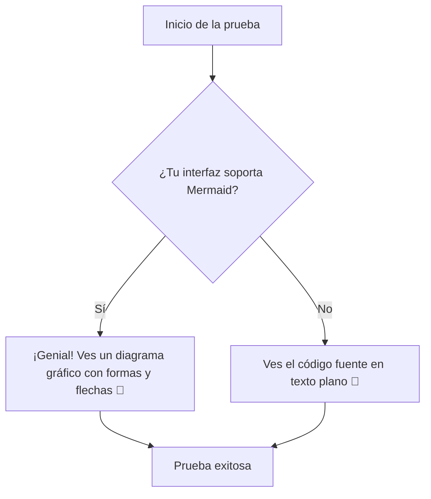
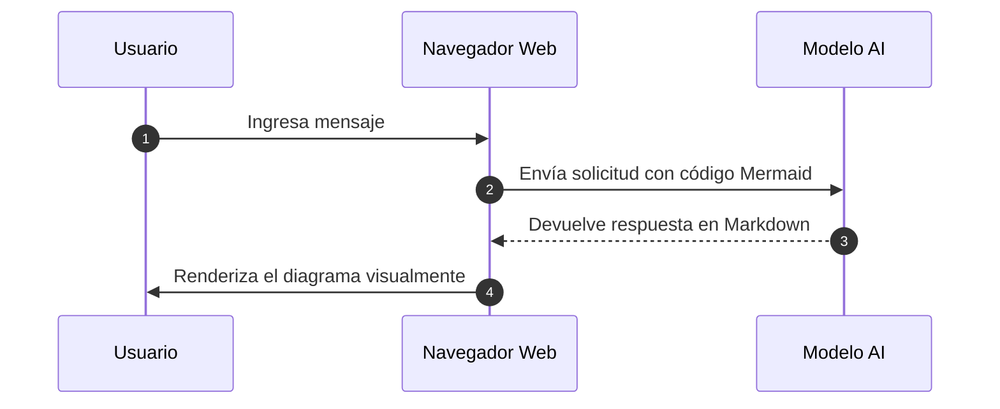

## Usuario
Estoy comprobando tu funcionamiento en web

## IA
¡Hola! Recibido fuerte y claro. 🚀

Estoy funcionando perfectamente y listo para ayudarte. Puedes ponerme a prueba con lo que necesites:

*   Hacer preguntas sobre cualquier tema.
*   Redactar, corregir o resumir textos.
*   Escribir, revisar o explicar código.
*   Traducciones, resolución de problemas o lluvia de ideas.

¿Qué te gustaría probar primero?

## Usuario
Vamos a ver si funciona la renderizacion de codigo mermaidjs en tu siguiente mensaje

## IA
¡Perfecto! Vamos a probarlo. 

Aquí tienes un diagrama de flujo de prueba escrito en Mermaid.js:

Y aquí tienes un ejemplo de diagrama de secuencia por si quieres probar algo más complejo:

¿Logras ver los esquemas gráficos renderizados o ves solo el bloque de código?
